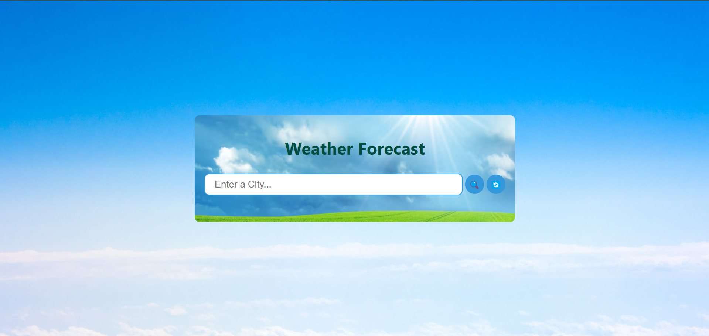
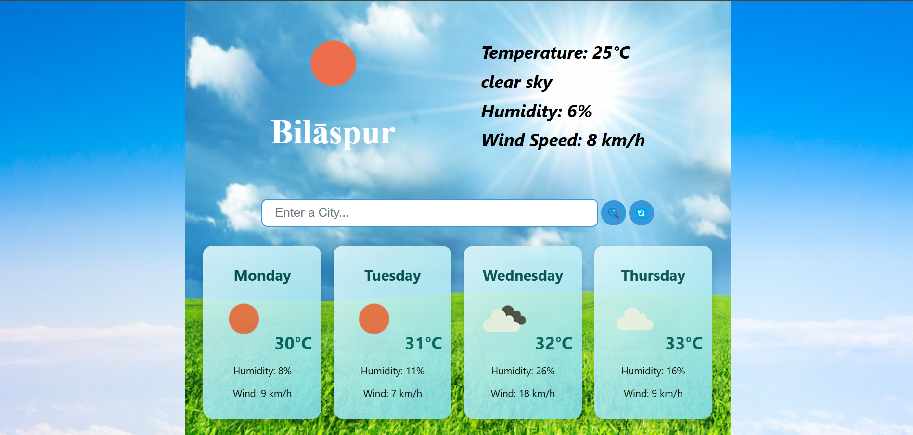
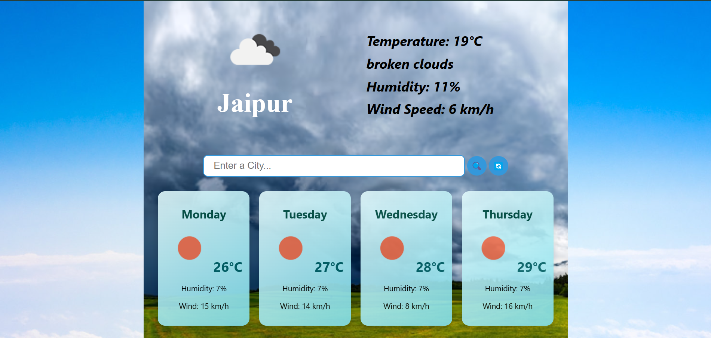
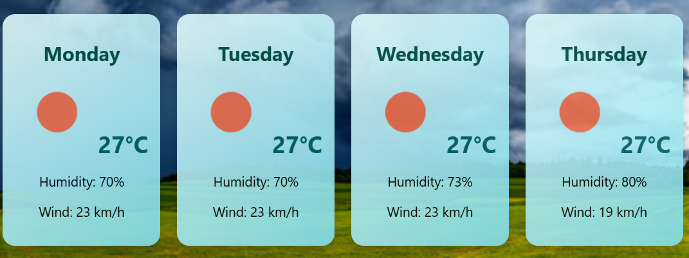
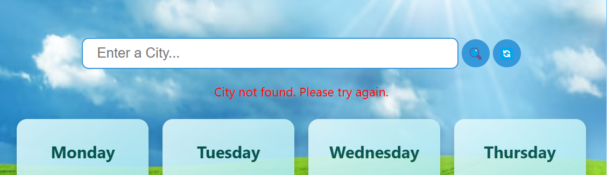

# Weather Web App
A modern, responsive web app that displays weather information using the OpenWeatherMap API.

## Description
This web app allows users to search for weather information by city name. It displays the current temperature, humidity, and wind speed along with recent search history. The app features a clean, modern design with smooth animations using Framer Motion and responsive layouts.

## Features
- Search weather by city name.
- Display temperature, humidity, and wind speed.
- Refresh Feature
- Next 4 days weather forcast
- BackGround image changes with the type of weather
- Responsive design for all devices.
- Real-time data from OpenWeatherMap API.

## Demo
[Live Demo](https://your-live-app-link.com)

## Screenshots










## Installation
```
Clone the repository:
git clone https://github.com/Aryaman028/Weather_app.git

Navigate to the project directory:
cd weather-app

Install dependencies:
npm install

Start the app:
npm start
```

## Technologies Used
- React (Functional Components with Hooks)
- OpenWeatherMap API
- CSS

## Usage
- Enter the city name in the search bar and hit enter.
- View the weather details displayed on the screen.
- Next 4 Days Weather forcast is also displayed

## Project Structure
```
src/
├── components/      # Reusable UI components
└── images/          # contains background images
```


